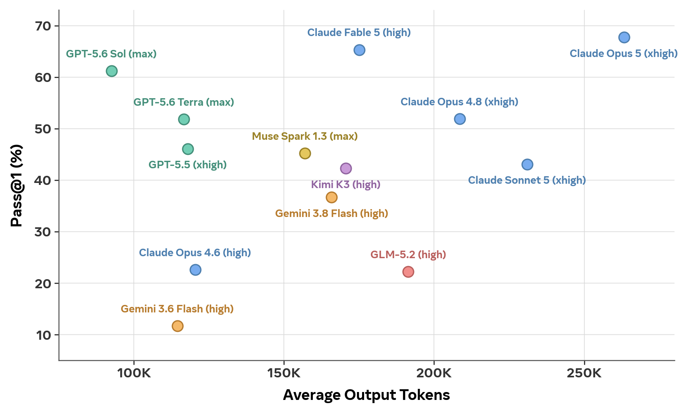

# E2E-SWE

E2E-SWE (End2End-SWE) is a benchmark for evaluating whether coding agents can build complete,
functional software repositories end to end. It contains 186 whole-repository generation tasks
spanning 11 programming languages.

Given only a natural-language specification and an empty workspace, the agent must implement a
complete, installable project, including a `setup.sh` that installs it. The result is copied into
a fresh container, installed, and run against a hidden test suite; a task is resolved only if
every test passes. The agent never sees the tests, and neither phase has network access.

This repository shows how to run E2E-SWE with mini-swe-agent under the Harbor framework.
`tasks/` holds the 186 tasks in the Harbor task format. `agents/` holds a mini-swe-agent adapter
that runs the agent on the host, outside the sandbox, so only shell commands cross the boundary.

## Leaderboard



Pass@1 is the percentage of tasks fully resolved. All numbers are averaged over four independent
runs. We use the strongest reasoning effort (shown in parentheses) that runs reliably within the
128K per-request output-token limit, to avoid API call failures caused by excessively long
reasoning.

## Setup

```bash
uv tool install harbor==0.22.0        # brings mini_swe_agent 2.4.6 with it
```

Python 3.12+ is required.

**Harbor needs a one-line patch.** Our tasks set `[verifier] environment_mode = "separate"`,
and on that path stock Harbor hardcodes `skip_tests_upload=True` — it assumes the verifier image
already ships its own `/tests`. These tasks upload the task's `tests/` at grade time instead, so
without the patch `/tests` never arrives and **every task fails with a score of zero**.
In `harbor/trial/trial.py` around line 720:

```diff
                      step_name=step_cfg.name if step_cfg is not None else None,
-                     skip_tests_upload=True,
+                     skip_tests_upload=False,
```

Verify before running anything:

```bash
python -c "import minisweagent, harbor; print(minisweagent.__version__)"
```

## Running

```bash
PYTHONPATH=/path/to/E2E-SWE \
  OPENAI_API_KEY=... \
  MSWEA_MODEL_KWARGS='{"reasoning":{"effort":"xhigh"}}' \
  harbor run -p tasks --agent agents.msw_harbor:MiniSweHostAgent \
    --model openai/gpt-5.6-sol \
    --ak config_path=/path/to/E2E-SWE/agents/e2e_swe_mini_sweagent.yaml \
    --jobs-dir jobs --job-name <name> -n 25 -q -y
```

## Reading results

Per trial, under `jobs/<job>/<task>__<id>/`:

| file | contents |
|---|---|
| `verifier/ctrf.json` | per-test results |
| `verifier/reward.txt` | 1 if every hidden test passed, else 0 |
| `agent/mini-swe-agent.trajectory.json` | full trajectory, rewritten after every step |
| `agent/mini-swe-agent.turns.jsonl` | append-only per-turn log, tailable during a run |
| `result.json` | timings, exceptions, and token usage under `agent_result` |

A task is **resolved** when `verifier/reward.txt` is 1. Equivalently, in `verifier/ctrf.json`,
`results.summary.passed` equals the task's `[verifier].test_case_count` and no test failed, was
skipped, or ended in any other state. The two checks agree.

## Citation

```bibtex
@misc{ding2026e2eswebenchmarkingllmsbuilding,
      title={E2E-SWE: Benchmarking LLMs on Building Working Codebases from Scratch},
      author={Hantian Ding and Chloe Bi and Jiacheng Zhu and John Yang and Matt Deitke and Pengcheng Yin and Zijian Wang and Rui Hou},
      year={2026},
      eprint={2609.38335},
      archivePrefix={arXiv},
      primaryClass={cs.SE},
      url={https://arxiv.org/abs/2609.38335},
}
```

## License

E2E-SWE is released under the [Creative Commons Attribution-NonCommercial 4.0 International
License](https://creativecommons.org/licenses/by-nc/4.0/) (CC BY-NC 4.0). See [LICENSE](LICENSE).
The data is intended for benchmarking purposes only.
